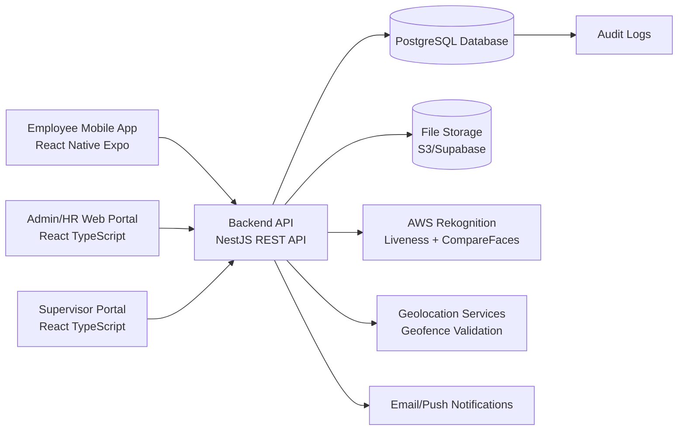
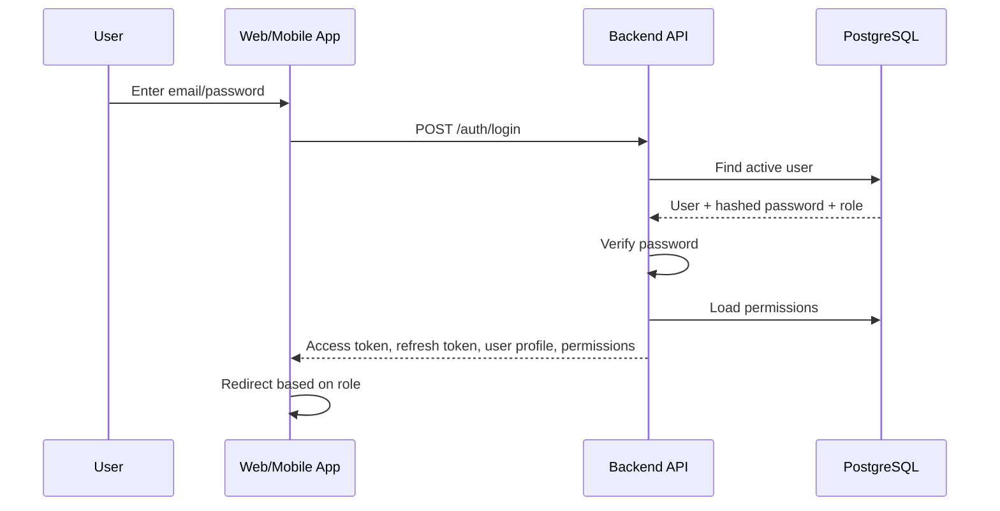
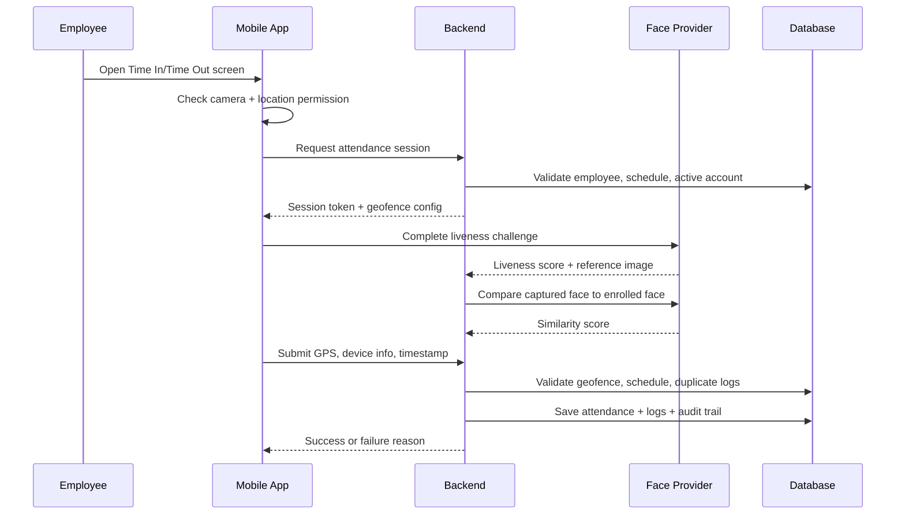
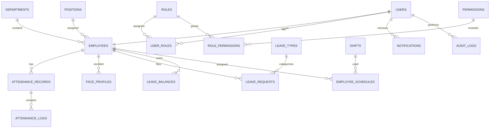

# Mobile Face Verification and Geotagged Attendance with Leave Management System

Project for Universal Leaf Philippines Inc. - Agoo, La Union

## 1. Executive Recommendation

The best capstone-ready stack is:

| Layer | Recommended Technology | Reason |
|---|---|---|
| Employee Mobile App | React Native + Expo + TypeScript | One codebase for Android/iOS, fast development, good camera/location support |
| Admin/HR Web Portal | React + Vite + TypeScript | Modern, maintainable, component-based dashboard development |
| Backend API | Node.js + NestJS + TypeScript | More structured than plain Express, supports modules, guards, validation, dependency injection, OpenAPI |
| Database | PostgreSQL | Strong relational integrity, ACID transactions, indexing, geospatial support through PostGIS |
| ORM | Prisma | Type-safe database access and migrations |
| Authentication | JWT access tokens + refresh tokens + bcrypt/argon2 password hashing | Secure, common, scalable API authentication |
| Authorization | RBAC with roles, permissions, and route guards | Ensures each role sees and accesses only allowed modules |
| Face Verification | AWS Rekognition Face Liveness + CompareFaces for production; ML Kit/MediaPipe for local face detection support | AWS provides realistic liveness and matching; ML Kit/MediaPipe help with real-time camera guidance |
| Geolocation | Expo Location + backend geofence validation + optional Google Maps | Captures GPS data and validates distance from approved worksite |
| File Storage | AWS S3 or Supabase Storage | Secure document/photo storage, signed URLs |
| Hosting | Render/Railway/Fly.io for capstone; AWS for production | Easier deployment for students, scalable path later |

Plain Node.js with Express is applicable, but for this system NestJS is better because the project has many modules: users, roles, attendance, leave, schedules, reports, audit logs, files, notifications, and face verification. NestJS gives a cleaner architecture while still using Node.js and TypeScript.

## 2. System Architecture



The mobile app is used by employees for time in/out, face verification, leave filing, attendance history, DTR viewing, and notifications. The web portal is used by Admin, HR Personnel, and Supervisors. All frontend apps call one backend REST API. The backend owns all business rules, authentication, RBAC, face verification decisions, geofence validation, attendance computation, leave approvals, and audit logging.

## 3. Roles and Access Control

The system uses one login page for all users. After login, the backend returns the user's role and permissions. The frontend redirects the user automatically.

| Role | Dashboard | Allowed Modules |
|---|---|---|
| Admin / HR Personnel | HR workforce dashboard | Users, employees, attendance, leave, schedules, reports, notifications, audit logs |
| Supervisor / Manager | Department dashboard | Assigned department attendance, assigned employee monitoring, leave validation, department reports |
| Employee | Mobile employee dashboard | Time in/out, face verification, geotagged attendance, leave filing, leave status, DTR, notifications |

RBAC should be database-driven. Do not hardcode menu items per user. Store roles and permissions in the database, then map permissions to navigation modules.

Example permissions:

| Permission Code | Description |
|---|---|
| users.create | Create users |
| users.update | Update users |
| employees:read | View employees |
| attendance.validate | Validate attendance |
| leave.approve | Approve/reject leave |
| reports.export | Export reports |
| schedules.manage | Manage shifts |

## 4. Authentication Flow



Security rules:

- Passwords are hashed with argon2 or bcrypt.
- Access token expires quickly, for example 15 minutes.
- Refresh token expires longer, for example 7 days, and is stored hashed in the database.
- In the web portal, refresh token should be stored in a secure HTTP-only cookie.
- In the mobile app, tokens should be stored using Expo SecureStore.
- Every protected API route uses JWT authentication and RBAC guards.

## 5. Face Verification Design

### Recommended Production Approach

Use AWS Rekognition Face Liveness for liveness checks and AWS Rekognition CompareFaces or SearchFacesByImage for face matching. AWS Face Liveness returns a confidence score and reference image after a short video selfie. AWS CompareFaces supports configurable similarity thresholds. This is more realistic and defensible for a capstone than building your own anti-spoofing model from scratch.

ML Kit and MediaPipe are useful for local camera guidance because they can detect faces, landmarks, expressions, and face tracking on-device, but ML Kit face detection does not recognize a person. Use them for face positioning, eye-open checks, and capture quality, not as the final identity decision.

### Face Registration Flow

1. HR/Admin creates an employee record.
2. Employee opens mobile app and starts face enrollment.
3. App asks for camera permission.
4. App captures multiple face samples under good lighting.
5. Backend starts a liveness session.
6. Employee completes liveness challenge.
7. Backend receives liveness score and reference image.
8. If liveness passes, backend stores:
   - employee_id
   - face provider ID or face collection ID
   - encrypted reference image path
   - enrollment status
   - enrollment timestamp
9. Admin can review failed or suspicious enrollments.

### Attendance Verification Flow



### Face Verification Rules

Suggested starting thresholds:

| Check | Suggested Rule |
|---|---|
| Liveness confidence | >= 90 |
| Face similarity | >= 95 for automatic approval |
| Similarity 90-94.99 | Mark as pending HR review |
| Similarity < 90 | Reject attempt |
| Max failed attempts | 3 attempts, then temporary lock or HR review |

Thresholds must be tested with real sample users before final defense. Face systems are probabilistic, so the final architecture should include manual HR review for borderline cases.

### Failed Attempt Handling

For every failed attempt, store:

- employee_id
- attempt type: time_in, time_out, enrollment
- liveness score
- similarity score
- failure reason
- GPS coordinates
- device ID
- IP address
- timestamp
- optional audit image path

After 3 failed attempts:

- Block attendance submission for 10-15 minutes or require HR validation.
- Notify HR dashboard.
- Save an audit log.

## 6. Geotagging and Geofencing Design

The backend, not the mobile app, must make the final geofence decision. The mobile app only captures GPS data.

### Geofence Configuration

Create a `work_locations` table:

- name: Universal Leaf Agoo Plant
- latitude
- longitude
- radius_meters, for example 100-300 meters depending on actual property size
- allowed_accuracy_meters, for example <= 50 meters
- active status

### Distance Validation

Use the Haversine formula or PostGIS distance functions.

Attendance is valid only if:

- GPS latitude/longitude exists.
- GPS accuracy is acceptable.
- Employee is within the configured radius.
- Timestamp is within schedule rules.
- Device is not obviously suspicious.

### GPS Spoofing Prevention

No mobile app can fully prevent GPS spoofing, especially on rooted/jailbroken devices. The practical capstone approach is layered risk detection:

- Reject poor GPS accuracy, for example > 50 meters.
- Capture device ID, OS, app version, IP address, and mock-location flag if available.
- Detect impossible travel speed between logs.
- Require face liveness at the same time as location capture.
- Store all location attempts in logs.
- Flag suspicious attempts for HR review instead of silently accepting them.

## 7. Database Architecture

Core database: PostgreSQL.



### Main Tables

#### users

| Column | Type | Notes |
|---|---|---|
| id | uuid PK | Primary key |
| email | varchar unique | Login email |
| password_hash | text | Hashed password |
| status | enum | active, inactive, locked |
| last_login_at | timestamp | Nullable |
| created_at | timestamp | Required |
| updated_at | timestamp | Required |

Indexes: `email`, `status`.

#### roles

| Column | Type | Notes |
|---|---|---|
| id | uuid PK | Primary key |
| name | varchar unique | Admin, Supervisor, Employee |
| description | text | Role description |

#### permissions

| Column | Type | Notes |
|---|---|---|
| id | uuid PK | Primary key |
| code | varchar unique | Example: attendance.validate |
| module | varchar | attendance, leave, users |
| description | text | Description |

#### employees

| Column | Type | Notes |
|---|---|---|
| id | uuid PK | Primary key |
| user_id | uuid FK users.id | Linked account |
| employee_no | varchar unique | Company employee number |
| first_name | varchar | Required |
| last_name | varchar | Required |
| department_id | uuid FK | Required |
| position_id | uuid FK | Required |
| employment_status | enum | regular, probationary, contractual, separated |
| hire_date | date | Required |
| supervisor_id | uuid FK employees.id | Nullable |

Indexes: `employee_no`, `department_id`, `supervisor_id`.

#### attendance_records

| Column | Type | Notes |
|---|---|---|
| id | uuid PK | Primary key |
| employee_id | uuid FK | Required |
| attendance_date | date | Required |
| time_in_at | timestamp | Nullable |
| time_out_at | timestamp | Nullable |
| status | enum | present, late, absent, leave, pending_review |
| total_minutes | int | Computed |
| late_minutes | int | Computed |
| undertime_minutes | int | Computed |

Unique index: `employee_id + attendance_date`.

#### attendance_logs

| Column | Type | Notes |
|---|---|---|
| id | uuid PK | Primary key |
| attendance_record_id | uuid FK | Required |
| employee_id | uuid FK | Required |
| log_type | enum | time_in, time_out, failed_attempt |
| captured_at | timestamp | Required |
| latitude | decimal | Required |
| longitude | decimal | Required |
| gps_accuracy_meters | decimal | Required |
| distance_from_site_meters | decimal | Required |
| face_liveness_score | decimal | Nullable |
| face_similarity_score | decimal | Nullable |
| verification_status | enum | approved, rejected, pending_review |
| device_id | varchar | Required |
| failure_reason | text | Nullable |

Indexes: `employee_id`, `captured_at`, `verification_status`.

#### face_profiles

| Column | Type | Notes |
|---|---|---|
| id | uuid PK | Primary key |
| employee_id | uuid FK | Required |
| provider | varchar | aws_rekognition |
| provider_face_id | varchar | Provider face identifier |
| reference_image_path | text | Encrypted/private storage path |
| enrollment_status | enum | pending, active, rejected |
| enrolled_at | timestamp | Nullable |

#### leave_requests

| Column | Type | Notes |
|---|---|---|
| id | uuid PK | Primary key |
| employee_id | uuid FK | Required |
| leave_type_id | uuid FK | Required |
| start_date | date | Required |
| end_date | date | Required |
| total_days | decimal | Required |
| reason | text | Required |
| status | enum | pending, supervisor_approved, approved, rejected, cancelled |
| reviewed_by | uuid FK users.id | Nullable |
| reviewed_at | timestamp | Nullable |

Indexes: `employee_id`, `status`, `start_date`.

#### audit_logs

| Column | Type | Notes |
|---|---|---|
| id | uuid PK | Primary key |
| actor_user_id | uuid FK | Nullable for system actions |
| action | varchar | Example: attendance.approved |
| entity_type | varchar | users, attendance, leave |
| entity_id | uuid | Affected row |
| old_values | jsonb | Before change |
| new_values | jsonb | After change |
| ip_address | varchar | Request IP |
| created_at | timestamp | Required |

## 8. Backend Architecture

Use modular clean architecture:

```text
backend/
  src/
    main.ts
    app.module.ts
    config/
    common/
      decorators/
      guards/
      filters/
      interceptors/
      pipes/
    modules/
      auth/
      users/
      roles/
      employees/
      attendance/
      face-verification/
      geolocation/
      leave/
      schedules/
      notifications/
      reports/
      audit/
      files/
    prisma/
      prisma.service.ts
  prisma/
    schema.prisma
    migrations/
```

Each module should contain:

```text
attendance/
  attendance.module.ts
  attendance.controller.ts
  attendance.service.ts
  dto/
  entities/
  policies/
```

Controller = HTTP request/response.
Service = business logic.
DTO = validated input/output shape.
Repository/Prisma = database access.
Guard = authentication and permission checks.

## 9. API Design

Base URL: `/api/v1`

### Auth

| Method | Endpoint | Purpose |
|---|---|---|
| POST | /auth/login | Unified login |
| POST | /auth/refresh | Refresh token |
| POST | /auth/logout | Logout |
| GET | /auth/me | Current user profile and permissions |

### Users and RBAC

| Method | Endpoint | Purpose |
|---|---|---|
| GET | /users | List users |
| POST | /users | Create user |
| PATCH | /users/:id | Update user |
| PATCH | /users/:id/status | Activate/deactivate |
| POST | /users/:id/reset-password | Reset password |
| GET | /roles | List roles |
| POST | /roles/:id/permissions | Assign permissions |

### Attendance

| Method | Endpoint | Purpose |
|---|---|---|
| POST | /attendance/session | Create attendance attempt session |
| POST | /attendance/time-in | Submit time in |
| POST | /attendance/time-out | Submit time out |
| GET | /attendance/me | Employee attendance history |
| GET | /attendance | HR attendance monitoring |
| PATCH | /attendance/:id/validate | HR validates pending attendance |

### Face Verification

| Method | Endpoint | Purpose |
|---|---|---|
| POST | /face/enrollment/start | Start face registration |
| POST | /face/enrollment/complete | Complete enrollment |
| POST | /face/liveness/session | Start liveness session |
| POST | /face/verify | Verify captured face |

### Leave

| Method | Endpoint | Purpose |
|---|---|---|
| POST | /leave-requests | File leave |
| GET | /leave-requests/me | Employee leave history |
| GET | /leave-requests | HR/supervisor leave list |
| PATCH | /leave-requests/:id/approve | Approve leave |
| PATCH | /leave-requests/:id/reject | Reject leave |
| GET | /leave-balances/me | View leave balances |

### Reports

| Method | Endpoint | Purpose |
|---|---|---|
| GET | /reports/dtr | DTR report |
| GET | /reports/attendance-summary | Attendance summary |
| GET | /reports/leave-summary | Leave summary |
| GET | /reports/payroll-attendance | Payroll attendance summary |

## 10. Web Portal Architecture

```text
apps/admin-web/
  src/
    app/
      routes/
      providers/
    components/
      layout/
        Sidebar.tsx
        Topbar.tsx
        PageShell.tsx
      ui/
        Button.tsx
        Card.tsx
        Table.tsx
        Badge.tsx
        Modal.tsx
        FormField.tsx
      charts/
    features/
      dashboard/
      users/
      employees/
      attendance/
      leave/
      schedules/
      reports/
    hooks/
    services/
    styles/
      tokens.css
      globals.css
    types/
```

Navigation should be generated from permissions:

```ts
const navItems = [
  { label: "Dashboard", path: "/dashboard", permission: "dashboard:view" },
  { label: "User Management", path: "/users", permission: "users:read" },
  { label: "Attendance Management", path: "/attendance", permission: "attendance:read" },
  { label: "Leave Management", path: "/leave", permission: "leave:read" },
  { label: "Reports", path: "/reports", permission: "reports:read" },
];
```

## 11. Mobile App Architecture

```text
apps/employee-mobile/
  src/
    app/
      navigation/
      providers/
    components/
      ui/
      forms/
      attendance/
    features/
      auth/
      dashboard/
      attendance/
      face-verification/
      leave/
      dtr/
      notifications/
    services/
      api.ts
      secureStorage.ts
      location.ts
      camera.ts
    hooks/
    types/
```

Mobile screens:

- Login
- Employee Dashboard
- Time In/Time Out
- Face Verification Camera
- Leave Filing
- Leave Status
- Attendance History
- DTR Viewer
- Notifications
- Profile

## 12. UI/UX Design Guidelines Based on Provided Images

Use the screenshots as the visual direction:

| UI Element | Design Direction |
|---|---|
| Primary color | Navy blue header: `#244C7A` or close |
| Text color | Deep navy: `#062B59` |
| Background | Light blue-gray: `#EDF3F8` |
| Cards | White, subtle border, small shadow, 8px radius |
| Sidebar | White, left fixed navigation |
| Active menu | Light cyan pill background |
| Tables | White panel, sticky header, light row dividers |
| Badges | Soft blue for role, soft green for active, soft red for rejected |
| Buttons | Navy outline or navy filled |
| Layout | Dense HRIS dashboard, not marketing-style |

Reusable components:

- `AppLayout`
- `Sidebar`
- `Topbar`
- `StatCard`
- `DataTable`
- `StatusBadge`
- `RoleBadge`
- `FilterTabs`
- `SearchInput`
- `ConfirmDialog`
- `FormModal`
- `DateRangePicker`
- `ReportExportButton`

Dashboard widgets:

- Total Employees
- Present Today
- Late Today
- Absent Today
- Pending Leave Requests
- Face Verification Failures
- Attendance Calendar
- Department Attendance Chart
- Leave Type Distribution
- Workforce Summary

## 13. Security Plan

Required controls:

- No hardcoded users, passwords, attendance records, or leave records.
- Use environment variables for secrets.
- Hash passwords with argon2 or bcrypt.
- Validate all request bodies with DTO validation.
- Sanitize uploaded filenames.
- Use signed URLs for private files.
- Enable CORS only for allowed frontend domains.
- Apply rate limiting to login and face verification endpoints.
- Store audit logs for important actions.
- Use RBAC guards on every protected route.
- Use HTTPS in deployment.
- Back up PostgreSQL regularly.
- Encrypt sensitive biometric references or store only provider IDs where possible.

Biometric privacy:

- Do not store raw face images publicly.
- Store face images in private object storage only.
- Restrict face profile access to backend services.
- Log all face profile enrollment/update/delete actions.
- Include employee consent in the system process.

## 14. Deployment Plan

Capstone-friendly deployment:

| Component | Recommended Service |
|---|---|
| Web Portal | Vercel or Netlify |
| Backend API | Render, Railway, Fly.io, or AWS EC2 |
| Database | Supabase PostgreSQL, Neon, Railway PostgreSQL, or AWS RDS |
| File Storage | Supabase Storage or AWS S3 |
| Mobile App Testing | Expo EAS internal builds |

Production path:

- AWS ECS/EC2 or Elastic Beanstalk for API
- AWS RDS PostgreSQL
- AWS S3 for files
- AWS Rekognition for face verification
- CloudFront for static assets
- CloudWatch for logs

## 15. Development Roadmap

### Phase 1 - Planning and Foundation

- Finalize requirements and scope.
- Prepare ERD and database schema.
- Create monorepo.
- Set up shared TypeScript types.
- Set up PostgreSQL and Prisma.
- Implement authentication and RBAC.

### Phase 2 - Admin/HR Web Portal

- Build reusable layout and UI components.
- Implement user management.
- Implement employee management.
- Implement schedule and shift management.
- Implement attendance monitoring dashboard.

### Phase 3 - Employee Mobile App

- Implement login.
- Implement employee dashboard.
- Implement location capture.
- Implement camera capture flow.
- Implement time in/time out API integration.

### Phase 4 - Face and Geofence Validation

- Implement face enrollment.
- Integrate face liveness.
- Integrate face comparison.
- Implement backend geofence validation.
- Add failed attempt handling.

### Phase 5 - Leave Management

- Implement leave filing.
- Implement supporting document upload.
- Implement leave approval workflow.
- Implement leave balances.
- Implement notifications.

### Phase 6 - Reports and Analytics

- DTR reports.
- Attendance reports.
- Leave reports.
- Tardiness and undertime reports.
- Payroll attendance summary.
- Export to PDF/CSV.

### Phase 7 - Testing and Defense Preparation

- Unit tests for services.
- API integration tests.
- Role permission tests.
- Face/geofence workflow tests.
- UI screenshots for presentation.
- Deployment demo.
- Prepare technical documentation.

## 16. Coding Standards

- Use TypeScript everywhere.
- Use PascalCase for React components.
- Use camelCase for variables and functions.
- Use kebab-case for route paths.
- Use DTOs for all API inputs.
- Use service classes for business logic.
- Do not put business logic inside controllers.
- Use reusable UI components instead of repeated CSS.
- Use shared constants for status values and permission codes.
- Keep modules independent.
- Write tests for authentication, RBAC, attendance validation, leave approvals, and geofence logic.

## 17. Final Capstone Position

This architecture is suitable for panel presentation because it is secure, scalable, realistic, and feasible for a student team. The system uses modern TypeScript-based development across mobile, web, and backend. PostgreSQL provides reliable relational data management. RBAC ensures each role only accesses allowed modules. Face verification is handled through a production-grade provider instead of an unrealistic custom AI model. Geotagging uses backend-side geofence validation with spoofing risk detection. The UI follows a professional HRIS dashboard style based on the provided screenshots.

## References

- Expo documentation: https://docs.expo.dev/
- NestJS documentation: https://docs.nestjs.com/
- PostgreSQL overview: https://www.postgresql.org/about/
- Prisma ORM documentation: https://www.prisma.io/docs/orm
- Google ML Kit Face Detection: https://developers.google.com/ml-kit/vision/face-detection
- MediaPipe Face Landmarker: https://developers.google.com/edge/mediapipe/solutions/vision/face_landmarker
- AWS Rekognition Face Liveness: https://docs.aws.amazon.com/rekognition/latest/dg/face-liveness.html
- AWS Rekognition CompareFaces: https://docs.aws.amazon.com/rekognition/latest/dg/faces-comparefaces.html
